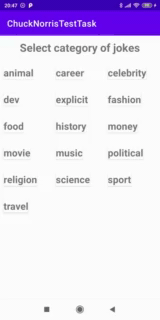
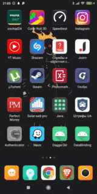
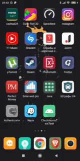

# ChuckNorrisApiApp
MVVM приложение с использованием Kotlin Coroutines и Retrofit 2. 

# Abilities
При первом запуске приложения подпишет Вас на уведомления, потом отобразится экран с выбором категорий шуток Чака Норриса, выбрав одну из них Вы попадете на следующий экран приложения с 15 рандомными шутками по выбраной Вами категории. Также открыть приложение можно и через пуш уведомление, которое будет приходить к Вам на телефон каждый час с момента последнего открытия приложения как напоминание, открыв приложение таким способом Вы попадете на экран с WebView, где Вы сможете выполнять какие-то действия. Открыв один раз приложение через пуш уведомление, Вы всегда теперь будете попадать на экран с WebView как бы Вы не открывали Ваше приложение. Повороты экрана во всех Activity обработаны.

## Some videos from the program

Первый запуск приложения

Запуск приложения из пуш уведомления

Запуск приложения после предыдущего его запуска из пуш уведомления

Have a nice day :D

